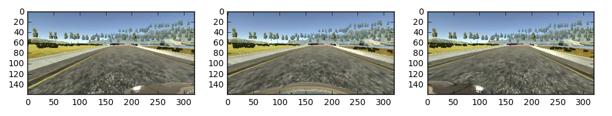
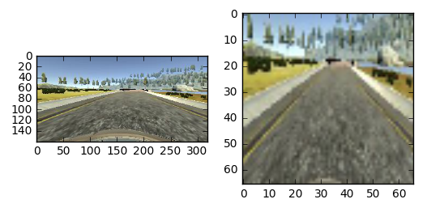
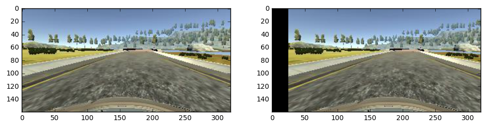

# CarND Project 3 - Use Deep Learning to Clone Driving Behavior

## Approach

I began to explore the solution space to this problem by trying out a few existing convolutional neural network architectures. The convnets are a natural choice for an image processing application such as this. The three networks I implemented were vgg16, commaai, and nvidia. Vgg16 was a particularly attractive choice because the model implementation and pre-trained set of weights are available directly from the keras library making it a good candidate to attempt transfer learning. I froze the convolutional layers and trained the fully connected layers at the end. Next, I tried two models that are more directly relevant since both come from autonomous driving projects. I used the model available from commaai’s github repo and the model described in the Nvidia paper titled “End to End Learning for Self-Driving Cars”. While my initial attempts with all three models resulted in a quick crash in the simulator, Nvidia architecture seemed to perform a bit better. I therefore decided to explore it further and since that ultimately led to a capable network I did not further examine the other architectures.

## Model Architecture
The final network architecture belongs to the class of convolutional neural networks whose structure is inspired by the animal visual cortex. A receptive field in the animal model is represented by a convolution operation which is used learn low level visual features such as edges in a way that is insensitive to translations within the visual field. The convolutional layer uses a smaller number of weights than a fully connected layer thus making learning more computationally efficient.

The upper layers of the network are composed of five convolutional layers interspersed with ELU’s (exponential linear unit) which is a type of activation function used to introduce nonlinearity into the network and thus enabling feature classifications with respect to non-linear decision boundaries in the input space. ELU’s are closely related to RELU’s (rectifier linear units) with the added benefit that the negative input region does not produce a zero output but rather exponentially tends to -1 thus mitigating the vanishing gradient problem. Both ELU’s are biologically inspired and computationally efficient blocks that are known to work particularly well in the context of deep neural networks.

Next, the outputs of the convolutional layers are fed into a sequence of four fully connected layers, each followed by a ELU activation. The purpose of this stage of the network is to map the visual features extracted by the convolutional layers into a steering command. 
The tendency of the original model described in the Nvidia paper to overfit resulted in two modifications: the fully connected part of the network is less deep (4 layers vs 5) and each layer is followed by a dropout stage. The input image size was reduced from 66x200 to 66x66 to gain a slight improvement in training speed without an apparent loss in the resulting model quality.

Finally, the cost function needed for the optimization algorithm is formed as mean squared error between the network’s prediction and the steering training data.

The resulting architecture has the following structure and dimensions:
~~~~
____________________________________________________________________________________________________
Layer (type)                     Output Shape          Param #     Connected to                     
====================================================================================================
convolution2d_6 (Convolution2D)  (None, 31, 31, 24)    1824        convolution2d_input_2[0][0]      
____________________________________________________________________________________________________
convolution2d_7 (Convolution2D)  (None, 14, 14, 36)    21636       convolution2d_6[0][0]            
____________________________________________________________________________________________________
convolution2d_8 (Convolution2D)  (None, 5, 5, 48)      43248       convolution2d_7[0][0]            
____________________________________________________________________________________________________
convolution2d_9 (Convolution2D)  (None, 3, 3, 64)      27712       convolution2d_8[0][0]            
____________________________________________________________________________________________________
convolution2d_10 (Convolution2D) (None, 1, 1, 64)      36928       convolution2d_9[0][0]            
____________________________________________________________________________________________________
flatten (Flatten)                (None, 64)            0           convolution2d_10[0][0]           
____________________________________________________________________________________________________
dense_5 (Dense)                  (None, 100)           6500        flatten[0][0]                    
____________________________________________________________________________________________________
dropout_4 (Dropout)              (None, 100)           0           dense_5[0][0]                    
____________________________________________________________________________________________________
dense_6 (Dense)                  (None, 50)            5050        dropout_4[0][0]                  
____________________________________________________________________________________________________
dropout_5 (Dropout)              (None, 50)            0           dense_6[0][0]                    
____________________________________________________________________________________________________
dense_7 (Dense)                  (None, 10)            510         dropout_5[0][0]                  
____________________________________________________________________________________________________
dropout_6 (Dropout)              (None, 10)            0           dense_7[0][0]                    
____________________________________________________________________________________________________
dense_8 (Dense)                  (None, 1)             11          dropout_6[0][0]                  
====================================================================================================

~~~~
The resulting model has substantially fewer trainable parameters than the model described in the Nvidia paper: approximately 140,000 vs 1,600,000. This reduced model complexity is a better match for the problem at hand both because simulated driving images are less complex than those in a real driving environment and due to a smaller training dataset required for faster iteration on modest computing resources.

## Data Set and Training Strategy

### Data Generation
At first I attempted to drive the car around the track in training mode using a mouse. However, I found it difficult to keep the car on the track let alone execute smooth recovery maneuvers that would be needed for good performance. Even using a joystick has proved somewhat difficult so decided to see how far along I can get by using the training set provided by Udacity. In order to obtain more turning recovery data I used the technique described in the Nvidia paper that synthesises additional training data from left and right camera images together with steering command augmentation. 

The three camera views from a single frame of the simulation are shown in the figure below.

*Left-Center-Right*

The motivation for steering augmentation becomes clear by looking at the picture above: the side images appear similar to a center camera view in situations that would require steering correction. By adding a small positive or negative steering offset to the left and right view, the model can learn the corrective turning behaviour without having to manually generate it on the track. The images suggest that the left-center and right-center shift corresponds to perhaps a few degrees of turn. I started with a guess of 2.0 deg (0.08) and eventually increased it all the way to 6.25 deg (0.25).

In fact the amount of steering augmentation is an important training hyperparameter: increasing it causes the model to be more aggressive in following turns but also makes the straight line following less smooth. The amount I settled on strikes a good balance between successfully negotiating tight turns on the second track and relatively smooth behavior on the straights.

## Data
Due to the large size of the dataset, mini-batches of data were produced just in time by a python generator and were fed into the learning algorithm via keras’s `fit_generator()` function. Only the data required by the current batch was loaded from the disk. This approach obviates the need to read all of the image data into memory at once which would have required roughly 3 Gb of RAM.

### Hyperparameters and Optimizer

The key model training hyperparameters are listed in the table below. Each was arrived at by the process of trial and error.

Hyperparameter | Value
----------------------|-------------
Batch size        | 64
Number of epochs | 20
Initial learning rate | 0.001
Left/Right steering augmentation | 0.25

The model was trained using Adam optimizer

### Image Pre-Processing 
In order to speed up training and remove some of the unnecessary parts of the image, each image was cropped: 34 pixeles removed from the top to remove some of the sky and 14 from the bottom to cut out the car’s hood. The image was then resized to 66x66 pixels. The comparison between an unmodified source image and the image following post-processing are shown below.

*Unmodified and Cropped and Scaled Image*

Each image was then normalized by scaling the color values in each channel to the range of [-0.5, 0.5]. The drive.py script was modified to to include the same pro-processing step prior to feeing the image data to the trained model.

### Overfitting Strategy and Image Augmentation
Reduced model complexity in terms of the  number of trainable parameters as well as introducing dropout stages into the fully connected layers coupled with generating more data from the left and right camera views are the key strategies to creating the model that does not overfit the data and can generalize well to the dataset it has not seen during training such as the second track. Two additional approaches which were suggested by Vivek Yadav
in this [post](https://chatbotslife.com/learning-human-driving-behavior-using-nvidias-neural-network-model-and-image-augmentation-80399360efee#.9rsa27jc1)
One was to randomly flip images during training with a corresponding adjustment of the steering angle to the opposite value, the other was to shift the images in X & Y directions by a random amount while compensating the steering angle for the side-to-side shift.

The lateral shift of the image is somewhat similar to the left and right camera view relative to the center view and requires steering angle compensation. See image below.

*Unmodified and Shifted by 25 px

I estimated that the left/right camera view shift corresponds to roughly 25 pixels. Using this information we can compute the steering augmentation amount that is consistent to that used for the left/right camera view images.

### Training and Validation Data 
During initial exploration of the model architectures and parameter space it became clear that model performance on the validation set was not a direct predictor of model’s success in the simulation. As a result, I opted to a 90/10% training/validation data split allocating a smaller portion of the data I’ve used in previous projects and what is typically recommended in order to use more of the available data for training. None of the data was allocated for a test set because the ultimate test was performing well on the the track in the simulation. In all, the model was trained on 21696 training examples and validated on 2412.

## Robustness Testing
In order to explore the robustness of the model with respect to disturbances I implemented a random perturbation in `drive.py` that randomly steered the model off-course for a short duration letting the model recover and regain control before the next perturbation was initiated. It is remarkable that the model is capable of staying on the track with modest amount of perturbation (7.5 deg (0.3) for ½ s) and that it exhibits stable and smooth behaviour when regaining control following the disturbance event. A short video of a perturbation is shown below.

* "Perturbation in the Midle of the Bridge*

## Training

The results of a training session are shown below. The model with the best behaviour resulted from epoch 18.

~~~~

Epoch 1/15
21632/21696 [============================>.] - ETA: 0s - loss: 0.0855Epoch 00000: saving model to nvidia-00.h5
21696/21696 [==============================] - 41s - loss: 0.0854 - val_loss: 0.0442
Epoch 2/15
21632/21696 [============================>.] - ETA: 0s - loss: 0.0716Epoch 00001: saving model to nvidia-01.h5
21696/21696 [==============================] - 39s - loss: 0.0716 - val_loss: 0.0525
Epoch 3/15
21632/21696 [============================>.] - ETA: 0s - loss: 0.0639Epoch 00002: saving model to nvidia-02.h5
21696/21696 [==============================] - 39s - loss: 0.0638 - val_loss: 0.0364
Epoch 4/15
21632/21696 [============================>.] - ETA: 0s - loss: 0.0582Epoch 00003: saving model to nvidia-03.h5
21696/21696 [==============================] - 39s - loss: 0.0582 - val_loss: 0.0316
Epoch 5/15
21632/21696 [============================>.] - ETA: 0s - loss: 0.0535Epoch 00004: saving model to nvidia-04.h5
21696/21696 [==============================] - 39s - loss: 0.0535 - val_loss: 0.0350
Epoch 6/15
21632/21696 [============================>.] - ETA: 0s - loss: 0.0518Epoch 00005: saving model to nvidia-05.h5
21696/21696 [==============================] - 39s - loss: 0.0518 - val_loss: 0.0337
Epoch 7/15
21632/21696 [============================>.] - ETA: 0s - loss: 0.0497Epoch 00006: saving model to nvidia-06.h5
21696/21696 [==============================] - 39s - loss: 0.0496 - val_loss: 0.0304
Epoch 8/15
21632/21696 [============================>.] - ETA: 0s - loss: 0.0486Epoch 00007: saving model to nvidia-07.h5
21696/21696 [==============================] - 39s - loss: 0.0486 - val_loss: 0.0356
Epoch 9/15
21632/21696 [============================>.] - ETA: 0s - loss: 0.0481Epoch 00008: saving model to nvidia-08.h5
21696/21696 [==============================] - 39s - loss: 0.0481 - val_loss: 0.0294
Epoch 10/15
21632/21696 [============================>.] - ETA: 0s - loss: 0.0482Epoch 00009: saving model to nvidia-09.h5
21696/21696 [==============================] - 39s - loss: 0.0482 - val_loss: 0.0283
Epoch 11/15
21632/21696 [============================>.] - ETA: 0s - loss: 0.0473Epoch 00010: saving model to nvidia-10.h5
21696/21696 [==============================] - 39s - loss: 0.0473 - val_loss: 0.0321
Epoch 12/15
21632/21696 [============================>.] - ETA: 0s - loss: 0.0462Epoch 00011: saving model to nvidia-11.h5
21696/21696 [==============================] - 39s - loss: 0.0462 - val_loss: 0.0330
Epoch 13/15
21632/21696 [============================>.] - ETA: 0s - loss: 0.0455Epoch 00012: saving model to nvidia-12.h5
21696/21696 [==============================] - 39s - loss: 0.0455 - val_loss: 0.0285
Epoch 14/15
21632/21696 [============================>.] - ETA: 0s - loss: 0.0449Epoch 00013: saving model to nvidia-13.h5
21696/21696 [==============================] - 39s - loss: 0.0449 - val_loss: 0.0288
Epoch 15/15
21632/21696 [============================>.] - ETA: 0s - loss: 0.0448Epoch 00014: saving model to nvidia-14.h5
21696/21696 [==============================] - 39s - loss: 0.0448 - val_loss: 0.0291

~~~~

## Results
The model is capable of staying on the road on the first track even in the presence of perturbations. In the course of normal (non-perturbed) driving the car tracks smoothly and does not cross yellow lines or red zebra sections indicating turns.
The model is also capable of completing the second track which it has never seen before during training. The second track required a slight increase in the throttle setting from 0.2 to 0.3. While the car generally behaves well it sometime comes close to edge of the road. Due to changes in elevation the speed is varies quite a bit over the course of the track. Although it does not cause the car to crash, it can be easily fixed by adding a speed controller that would track the desired speed rather than commanding the throttle in an open loop fashion. I have not experimented with this approach.